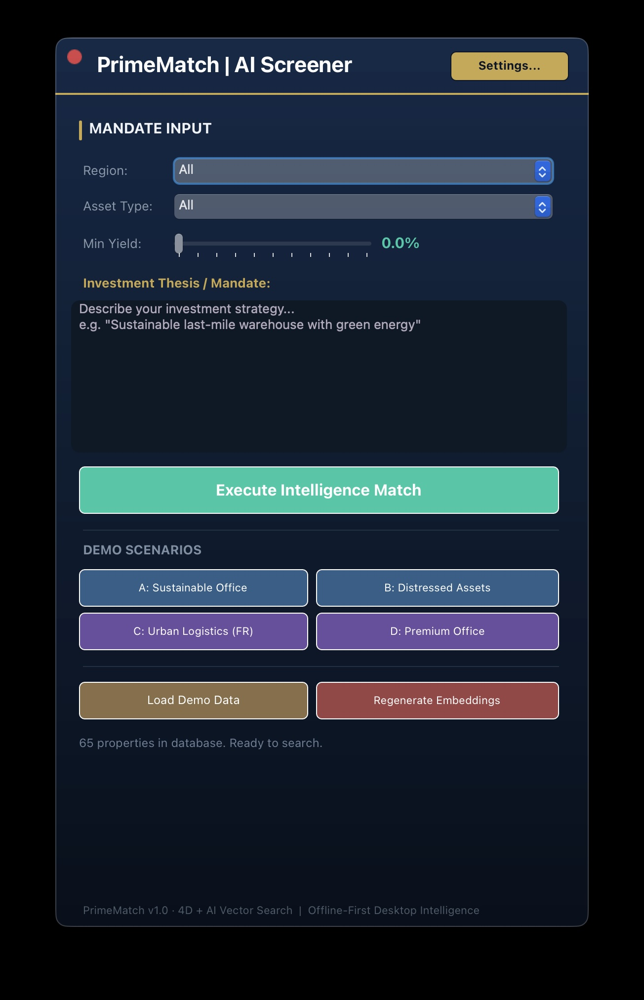
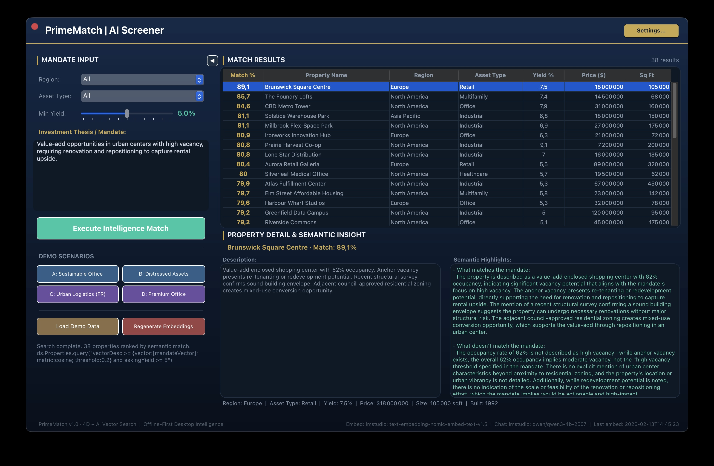

# PrimeMatch - AI-Driven Real Estate Investment Screener

A **4D** desktop application that uses **vector embeddings** and **cosine similarity** to semantically match commercial real estate properties against investor mandates. Describe your investment thesis in natural language and PrimeMatch instantly ranks properties by relevance - powered by local or cloud AI.

## Features

- **Semantic Vector Search** - Converts property descriptions and investor mandates into vector embeddings, then uses 4D's native `4D.Vector` type with cosine similarity to rank the best matches.
- **Multi-Provider AI** - Works with **Ollama**, **LM Studio**, or **OpenAI** for both embeddings and chat completions. Switch providers and models on the fly from the settings dialog.
- **Offline-First** - Runs entirely on your desktop with a local LLM (Ollama / LM Studio). No cloud dependency required.
- **AI-Powered Analysis** - Select a matched property and get an instant semantic analysis explaining *what matches* and *what doesn't match* your mandate, generated by a chat model in a background worker.
- **Bilingual UI** - Full English / French localization via XLIFF. Language can be switched live from the settings dialog.
- **Dark Theme UI** - Modern dark interface with animated progress indicators, collapsible results panel, and window drag support.
- **Demo Scenarios** - Four built-in demo mandates (2 English, 2 French) to showcase the matching engine immediately.
- **Search History** - Every search is logged with filters, date, and result count for later review.

## Screenshots





## Architecture

```
Project/Sources/
├── Classes/
│   ├── AppUtils.4dm           # Shared singleton - settings I/O & localization helpers
│   ├── formPrimeMatch.4dm     # Main form class - search, embed, results, UI logic
│   └── formAIConfig.4dm       # Settings dialog class - provider/model selection
├── Forms/
│   ├── PrimeMatch/            # Main screener form (JSON + method + object methods)
│   └── AIConfig/              # AI configuration dialog
├── Methods/
│   ├── PM_OnStartup.4dm       # Application entry point (HDI process pattern)
│   └── _semanticHighlightsAsync.4dm  # Background worker for chat AI calls
└── DatabaseMethods/
    └── onStartup.4dm          # Calls PM_OnStartup
```

### Database Schema

| Table | Purpose |
|-------|---------|
| **Properties** | Commercial real estate listings - name, region, asset type, yield, price, sqft, year built, description, and a `vectorDesc` field (`4D.Vector`) storing the embedding |
| **SearchHistory** | Audit log of every search - mandate text, filters applied, date, and result count |

### How It Works

1. **Load Data** - Import the bundled 50-property demo dataset (`Resources/demo_properties.json`). Each property description is sent to the embedding model and the resulting vector is stored in the `vectorDesc` field.
2. **Enter a Mandate** - Type a free-text investment thesis (e.g., *"Carbon-neutral office space with sustainable features"*) and optionally filter by region, asset type, or minimum yield.
3. **Execute Match** - The mandate text is embedded, then a single ORDA query combines vector similarity (`>=` with cosine threshold) and conventional filters in one native pass.
4. **Review Results** - Properties are ranked by match percentage. Select one to trigger a chat AI call that generates a structured analysis of alignment with your mandate.

## Prerequisites

| Requirement | Details |
|-------------|---------|
| **4D 21** | Requires `4D.Vector` support and AIKit compatibility |
| **4D AIKit** | Automatically fetched via the project's [dependencies.json](Project/Sources/dependencies.json) from [4d/4D-AIKit](https://github.com/4d/4D-AIKit) |
| **AI Backend** (one of) | [Ollama](https://ollama.com/) on `127.0.0.1:11434` **or** [LM Studio](https://lmstudio.ai/) on `localhost:1234` **or** an OpenAI API key |
| **Embedding Model** | Any OpenAI-compatible embedding model (default: `nomic-embed-text` / `text-embedding-nomic-embed-text-v1.5`) |
| **Chat Model** | Any OpenAI-compatible chat model (default: `llama3.2` / `qwen3-4b`) |

## Getting Started

### 1. Clone the Repository

```bash
git clone https://github.com/<your-username>/4D-real-restate-AI.git
```

### 2. Start a Local AI Server

**Option A - Ollama:**

```bash
ollama pull nomic-embed-text
ollama pull llama3.2
ollama serve
```

**Option B - LM Studio:**

Download and start [LM Studio](https://lmstudio.ai/), load an embedding model and a chat model, then start the local server on port 1234.

### 3. Open in 4D

Open the project file `Project/4D-real-restate-AI.4DProject` in 4D 21. The `4D AIKit` component will be resolved automatically from `dependencies.json`.

### 4. Run the Application

Run the project in **Application mode**. The PrimeMatch form opens automatically via the `On Startup` database method.

### 5. Load Demo Data

Click **Load Demo Data** to import 50 commercial properties and generate their vector embeddings. This may take a minute depending on your AI backend.

### 6. Search

Type an investment mandate, adjust filters, and click **Execute Intelligence Match**.

## Configuration

Click **Settings...** (top-right) to open the AI Configuration dialog where you can:

- Switch between Ollama, LM Studio, or OpenAI for embeddings and chat independently
- Browse and select available models from each server
- Set your OpenAI API key (stored locally in `Resources/settings.json`)
- Change the UI language (English / Français)

Settings are persisted to `Resources/settings.json`.

## Demo Scenarios

| Button | Language | Mandate |
|--------|----------|---------|
| **A** | English | Carbon-neutral office space for tech tenants with sustainable features |
| **B** | English | Value-add urban properties with high vacancy for renovation upside |
| **C** | French | Entrepôt logistique du dernier kilomètre en zone urbaine dense |
| **D** | French | Immeuble de bureaux haut de gamme avec potentiel de restructuration |

## Project Structure

```
4D-real-restate-AI/
├── Project/
│   ├── 4D-real-restate-AI.4DProject   # 4D project file
│   ├── Sources/
│   │   ├── Classes/                    # Form classes & utilities
│   │   ├── Forms/                      # PrimeMatch & AIConfig forms
│   │   ├── Methods/                    # Startup & async worker methods
│   │   ├── DatabaseMethods/            # On Startup entry point
│   │   ├── catalog.4DCatalog           # Database schema (Properties, SearchHistory)
│   │   └── dependencies.json           # 4D AIKit component dependency
│   └── DerivedData/                    # 4D-generated metadata
├── Resources/
│   ├── settings.json                   # AI provider configuration
│   ├── demo_properties.json            # 50 sample commercial properties
│   ├── en.lproj/ui.xlf                 # English localization
│   └── fr.lproj/ui.xlf                 # French localization
├── Data/                               # Database files (gitignored in production)
├── .github/
│   └── .instructions/                  # GitHub Copilot custom instructions for 4D
├── README.md
└── LICENSE
```

## GitHub Copilot Instructions

This project includes a set of [GitHub Copilot custom instructions](.github/.instructions/README.md) tailored for 4D development. They provide Copilot with 4D-specific syntax, conventions, form architecture patterns, and error handling guidance - resulting in significantly better code suggestions when editing `.4dm` files in VS Code.

## Technologies

- [**4D**](https://www.4d.com/) - Application development platform with built-in database, ORDA, and vector support
- [**4D AIKit**](https://github.com/4d/4D-AIKit) - 4D component providing an OpenAI-compatible client for embeddings and chat completions
- [**Ollama**](https://ollama.com/) / [**LM Studio**](https://lmstudio.ai/) - Local LLM inference servers
- [**OpenAI API**](https://platform.openai.com/) - Cloud AI provider (optional)

## License

This project is licensed under the MIT License - see the [LICENSE](LICENSE) file for details.
